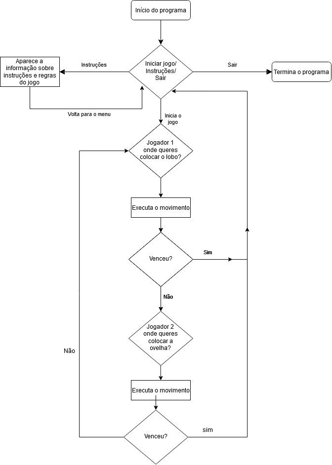

# 1º Projeto de Linguagens de Programação I 2019/2020

## Autores
Diogo Heriques, a21802132

Inácio Amerio, a21803493

João Dias, a21803573

[Repositório Git](https://github.com/FPTheFluffyPawed/Project1_LP12019)

## Organização do trabalho

Cada membro do grupo fez:

Diogo Henriques:

* Fez a classe `Menu` e `Board`.
* Fez o documento `Markdown`.

Inácio Amerio:

* Fez a classe `Board`, `EnumPosition`, `Position`.

João Dias:

* Fez as classes `Game` e `Sheep`.

## Descrição da solução

### Estrutura do Programa
O programa foi estruturado em:

* Dados de Estrutura (As _enumPosition_ e _Position_)
* Elementos de Estrutura (_Board_)
* Agentes do jogo (_Wolf, Sheep_)
* Estrutura de Jogo e Apresentação (_Game, Program, Menu_)

Nós usamos classes para estruturar o nosso programa, de forma a que as mesmas 
interagissem entre si e fazendo `Game` ser chamado no `Menu` e por
fim executar `Menu` no `Program`.

Os dados de estrutura não fazem nada senão guardar informação que vai ser usada 
pela `Board`, `Sheep` e `Wolf`.

Os Ajudantes do jogo, `Sheep` e `Wolf` interagem entre si sendo que `Wolf`
extende de `Sheep` para adotar o movimento e a cor que é definido na classe
`sheep`.

As classes de Estrutura de Jogo e Apresentação "ordenam" todas as anteriores, 
inicializando-as e apresentando os dados, agentes, e elementos.

### Fluxograma 

### Referências

* 
